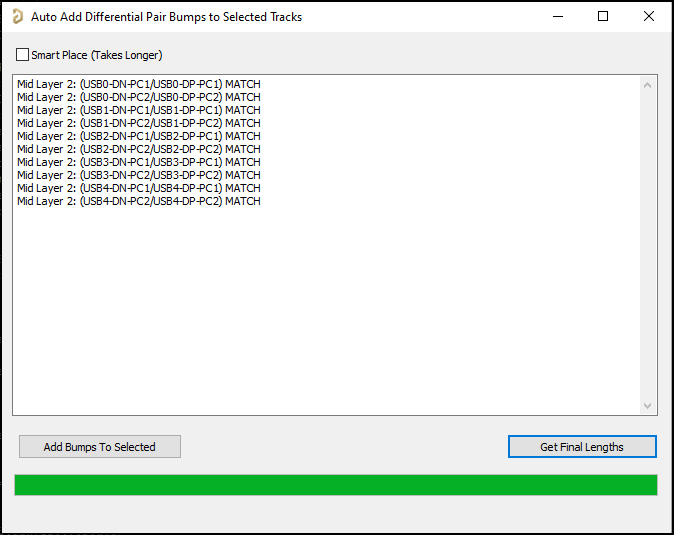

# How to Run (GUI)

1. Select all differential pairs that you want to length match with compensation bumps. You can select on just one layer or on multiple layers, but speed is increased when using just one layer.
	Note: It can be useful to run Route --> Retrace Selected before running script.
	Note: You can also select non diff pair tracks, they will just be ignored.
2. File --> Run Script... --> RunGUI
3. Add Bumps To Selected
Options: 
- SmartPlace, Tries to place bumps near greatest length mismatches between pairs. Takes long to run.
- Get Final Lengths, Remeasures all pair lengths with newly added bumps.

# How to Run (Without GUI - Defaults to not using smart placement)
1. Select all differential pairs that you want to length match with compensation bumps. You can select on just one layer or on multiple layers, but speed is increased when using just one layer.
2. File --> Run Script... --> RunNoGUI

This script will match the P/N lengths for each layer independently by adding compensation bumps to the shortest of the pair. Adds 2 bumps per 45 degree bend in pair (overall bend, not each bend since some cancel out).

# TODO
- Run Route --> Retrace Selected before running script??? Client.SendMessage('PCB:Retrace', 'Track=True', 255, Client.CurrentView); // Retrace selected tracks  
- Every two bumps, add a gap with no bumps
- Replace calculations in GetAngleBetweenTracks with function GetCoordFromLocation